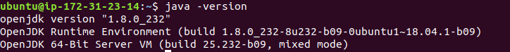

Ansible Role: Java
=========

An Ansible role to install and configure Java on Debian-based and RedHat-based systems.

📦 Version History
---------------


|**Date**| **Version**| **Description**| **Changed By** |
|----------|---------|---------------|-----------------|
| **June 2020** | v1.0        | Initial Draft            | Sudipt Sharma             |
| **May 2025** | v1.1        | Molecule Integration     | Abhishek Vishwakarma      |

✨ Features
----------------

- Installs Java (default is Java 17).
- Supports overriding the version via role variables.
- Supports both Debian-based and RedHat-based distributions.
- Optionally sets the `JAVA_HOME` environment variable.

⚙️ Role Variables
--------------

You can customize the Java version using the following variables:

| Variable               | Default Value          | Description                          |
|------------------------|------------------------|--------------------------------------|
| `java_version_redhat`  | `java-17-openjdk`   | Java version for RedHat-based OS|
| `java_version`         | `openjdk-17-jdk`        | Java version for Debian-based OS       |


🧾 Inventory Example
----------

```ini
[javahost]                 
192.168.1.198    ansible_user=ubuntu   
192.168.3.201    ansible_user=opstree 
```

📘 Example Playbook
----------------
* Here is an example playbook `site.yml` :-
```plain
- hosts: javahost
  roles:
    - role: java
```
Run it using:
* **ansible-playbook site.yml**

✅ Post-Installation
--------------------
After successful installation of java, verify it with:
```bash
java -version
```


🧪 Molecule Test
----------------
To test this role using Molecule, refer to the [Molecule Test Documentation](./molecule/README.md).

🔮 Future Enhancements
-----------------------

🔗 References
----------
- **[Java Official Website](https://www.java.com/en/)**
- **[Molecule (Ansible Role Testing)](https://ansible.readthedocs.io/projects/molecule/)**

📬 Contact Information
----------------------
For questions, suggestions, or issues related to this role, please contact:

📧 Email: [opensource@opstree.com](mailto:opensource@opstree.com)

🏢 Organization: [OpsTree Solutions](http://opstree.com)